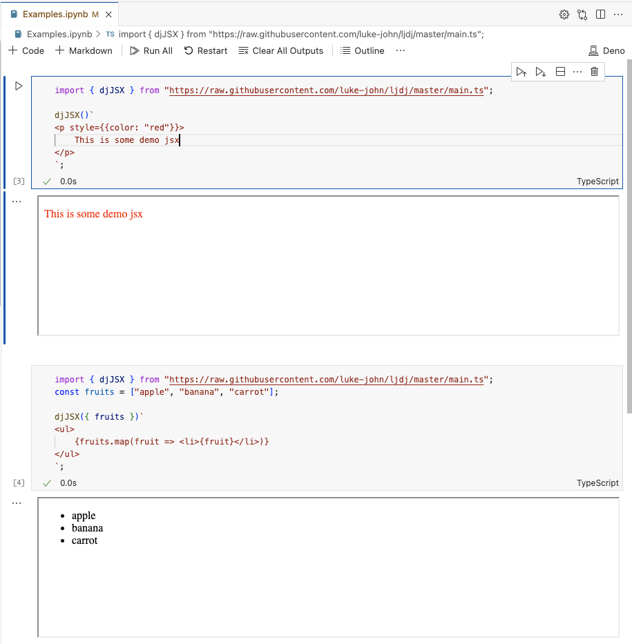

> [!NOTE] This is provided as an example

# Demo Jupyter JSX



## Basic usage

```ts
import React from "npm:react";
import { djSSR } from "https://raw.githubusercontent.com/luke-john/ljdj/master/main.ts";

djSSR()`
    <ul>
        {fruits.map((fruit, i) => <li key={i}>{fruit}</li>)}
    </ul>
`;
```

## SPA mode

SPA mode allows slightly richer experiences, where it transfers the source and
some data into the html.

### Basic usage

```ts
import React from "npm:react";
import { djSPA } from "https://raw.githubusercontent.com/luke-john/ljdj/master/main.tsx";
const fruits = ["apple", "banana", "carrot"];

djSPA(
  { fruits },
  (transferProps) => (
    <ul>
      {fruits.map((fruit, i) => (
        <li key={i} style={fruit === "apple" ? { color: "red" } : {}}>
          {fruit}
        </li>
      ))}
    </ul>
  ),
);
```

### Using react hooks

The SPA which receives the transferred source and props, puts React in scope
when calling the transferred source. This means you can use useState and other
hooks.

```ts
import React from "npm:react";
import { djSPA } from "https://raw.githubusercontent.com/luke-john/ljdj/master/main.tsx";
const fruits = ["apple", "banana", "carrot"];

djSPA(
  { fruits },
  (transferProps) => {
    const [state, setState] = React.useState(0);

    return (
      <div>
        <p>counters: {state}</p>
        <button
          onClick={() => {
            // console.log(state)
            setState(state + 1);
          }}
        >
          increment counter
        </button>
      </div>
    );
  },
);
```
